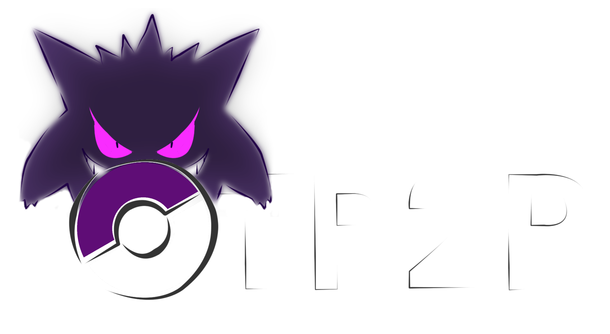
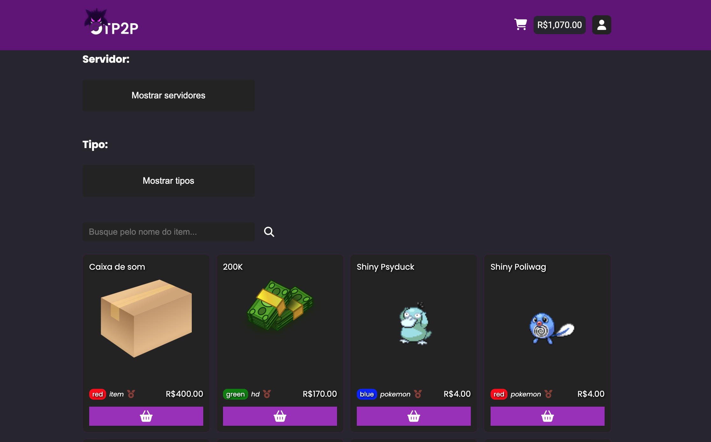

<h1 align="center" style="font-weight: bold;">OTP2P MarketPlace P2P 💻</h1>
<p align="center">
    
</p>

<p align="center">
    <a href="#stack">Stack</a> • 
    <a href="#pages">Pages</a> • 
    <a href="#started">Getting started</a> • 
    <a href="#layout">Layout</a> • 
</p>

<p align="center">
    <b>A Marketplace P2P made to players of an poketibia have another option, better and secure to trade and find items. </b>
</p>

<h2 id="stack">💻 Technologies</h2>

- Angular 17
- TypeScript
- RxJS
- HTML5
- CSS3
- Angular Material

<h2 id="pages">📟 Pages</h2>

- Home
- Profile
- Cashout
- Deposit
- Donate (beta only)
- email verification (redirected by link sent to user)
- FAQ
- Feedback (beta only)
- How it works (beta only)
- Item
- Login
- New offer
- Next features (beta only)
- Not logged
- Player
- Trades
- Your offers


<h2 id="started">🧩 Getting Started</h2>

<h3>Prerequisites</h3>

- [Angular-cli](https://github.com/angular/angular-cli)
- [Git](https://git-scm.com)

<h3>Cloning</h3>

Clone this repository:
```
git clone https://github.com/Sr-Van/otp2p-frontend.git
```

<h3>Runing project localy</h3>

Open the terminal on its folder and run:

```
ng serve
```

You can find the local version in `http://localhost:4200/`


<h2 id="layout"> 🎨 Layout</h2>

<p align="center">
    
</p>
